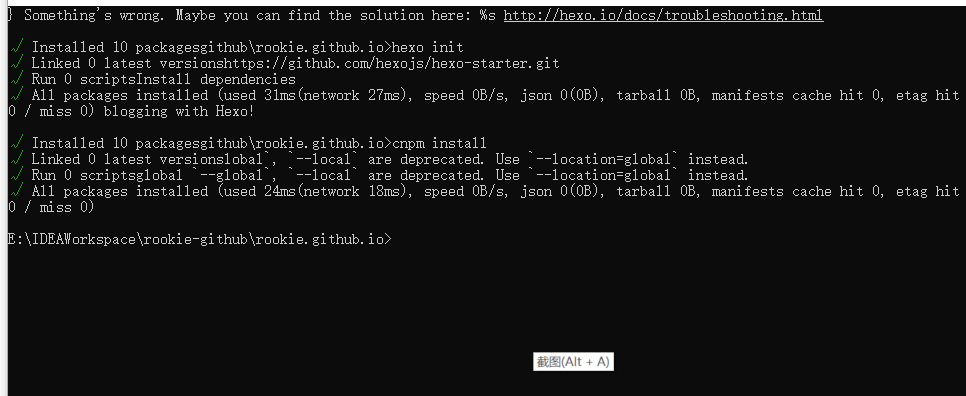

### 环境准备

通过hexo+github搭建博客需要安装环境，首先需要在电脑安装git,node.js以及在github上面申请一个账号，这些都是基础的安装，不再赘述。由于我们在国内，有时候访问外网下载的时候比较慢，所以这里对npm添加国内的阿里镜像，添加方式为安装好Node.js后，在windows命令行下面运行如下命令

```java
npm config set registry https://registry.npm.taobao.org
```

### 创建github仓库

在github上面创建如下仓库，必须以.github.io结尾，如下图


设置一个主题

在当前项目下选择settings->Pages->Choose a theme，随便选择一个主题，然后访问https://rookie.github.io/地址，这个地址是你的项目名称，即可看到一个简单的页面。然后将你的项目下载到本地电脑，在下载之前先设置SSH keys到github,具体如何设置参考百度

### hexo初始化及本地访问

在本地电脑创建目录rookie.github.io，我的目录为E:\IDEAWorkspace\rookie-github\rookie.github.io，然后执行如下命令安装hexo-cli

```java
cnpm install hexo-cli -g
```


在cmd命令行执行如下命令,如图

```java
hexo init 

cnpm install 
```



最终生成的文件如下


执行如下命令进行服务启动

hexo g 表示生成静态网页文件

hexo s 表示启动hexo服务

```java
hexo g

hexo s
```

然后访问  http://localhost:4000/即可看到博客已经完成搭建


### 切换Meadow主题

进入到rookie.github.io的的themes目录下，执行如下命令将主题下载到本地

git clone https://github.com/kb1000fx/Meadow

切换主题

编辑rookie.github.io目录下的_config.yml文件，并将主题设置为meadow

```
theme:meadow
```

执行如下命令启动hexo服务

hexo clean 表示清除缓存，即将public目录下网页清除掉

```java
hexo clean

hexo g

hexo s
```

如图，此时访问页面如下


### 将本地代码部署到github上面的rookie.github.io仓库中

修改_config.yml文件最后一行deploy为

```java
deploy:
  type: git
  repository: git@github.com:albert-liu435/rookie.github.io.git
  branch: main
```

安装 hexo-deployer-git

```java
cnpm i hexo-deployer-git
```

安装成功后执行如下命令

```java
hexo clean

hexo g

hexo d
```

hexo d表示部署，本实例部署到github上面

### Meadow主题设置

#### 创建标签页

```
hexo new page "tags"
```

编辑标签页

```
---
title: tags
date: 2022-06-11 18:17:08
type: "tags"
layout: "tags"
---
```

#### 创建分类页

```
hexo new page "categories"
```

编辑分类页

```java
---
title: categories
date: 2022-06-11 18:20:42
type: "categories"
layout: "categories"
---
```

#### 创建工具箱页

```
hexo new page "tools"
```

编辑分类页

```java
---
title: tools
date: 2022-06-11 18:20:42
type: "tools"
layout: "tools"
---

```

#### 创建About页

```
hexo new page "About"
```

编辑About页

```java
---
title: About
date: 2022-06-11 18:20:42
type: "About"
layout: "About"
---
```

设置中文

在_config.yml中设置中文等信息

```java
title: albert-liu435的博客
subtitle: ''
description: '技术学习'
keywords:
author: albert.liu435
language: en
timezone: ''
```

部署到github,访问https://albert-liu435.github.io查看如下图


至此博客搭建完成


参考：

[Meadow](https://garybear.cn/hexo-theme-meadow/#/README)

[hexo中文文档](https://hexo.io/zh-cn/docs/one-command-deployment)


