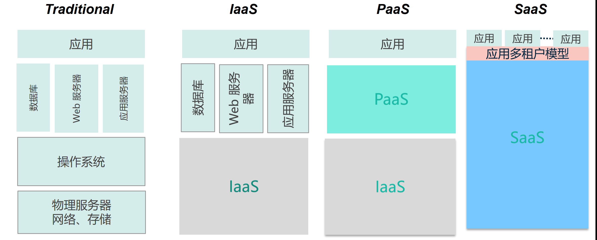

最近在公司里面经常听到一些paas saas iaas云服务的名词，把我自己都听蒙圈啦，所以就各种找资料终于对这三个名词有了一定的了解

IAAS(nfrastructure as a Service),即基础设施即服务,其中包括处理CPU、内存、存储、网络和其它基本的计算资源等服务，该服务可以提高硬件的自动化管理，人与机器的解耦合，获得效率和提高资源的利用率

　　从云的角度来讲:该服务又存在以下三种情况，即公有云，私有云和混合云三种

　　PAAS(Platform as a Service):即平台即服务,用来进行应用的自动化，应用与OS的解耦合，获得弹性/简化运维，该服务包括如数据库，web服务器，应用服务器

　　SAAS(Software as a Service):即软件服务，该服务属于IAAS和PAAS的结合，是有两种服务组合起来提供的一种服务

　　　总之这三种都是有云计算厂商提供的一种便捷的服务模式而已