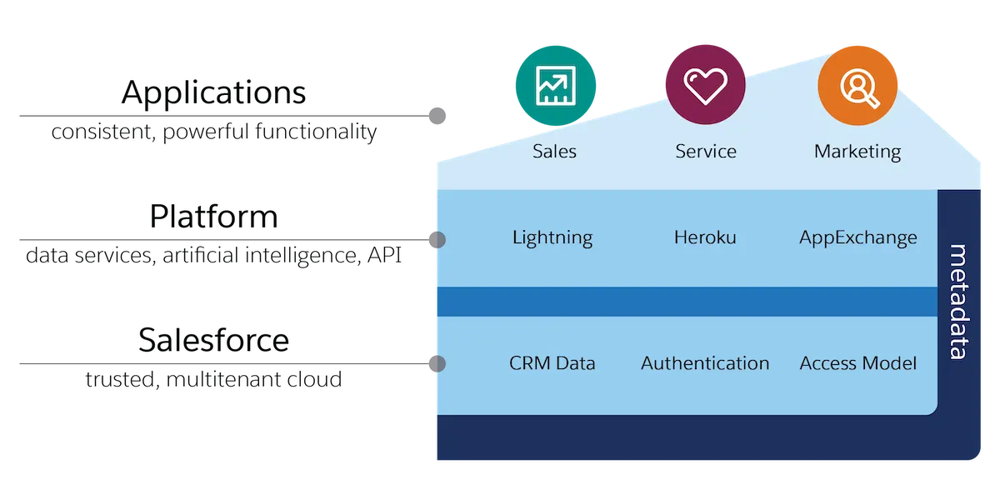

salesforce是一个云管理平台，包括开发者平台和应用平台，按照云服务的划分，可以将salesforce划分为SAAS产品。salesforce是一个统称，他的产品包含很多，包括SalesCloud,ServiceCloud,MarketingCloud,CommerceCloud，SalesforcePlatform等等是一个完整的生态。2020年salesforce收购tableau使其生态更加完善。对于一个非开发人员来说，也可以通过编辑来达到开发出网页来。

salesforce的优势

salesforce的是一个云产品，有自己的开发环境和生态环境，对公司来说不需要再搭建自己的IDC机房，可以直接购买直接使用，所有的数据都保存在云端。但是我感觉有一点不太好的地方就是比较贵。

salesforce的开发学习成本较低，后台的技术为apex,类似java语言一样是一个面向对象的一样，前端主要为html，JS,CSS等开发出的组件供我们使用

### salesforce架构

如图：salesforce最底层存放的是客户的数据，包括用户的权限，Platform层提供对数据访问的支持，Application层是应用层，包括一个个应用。

申请自己的salesforce开发环境https://www.salesforce.com/form/signup/freetrial_training.jsp

[参考](https://trailhead.salesforce.com/content/learn/modules/starting_force_com/starting_understanding_arch?trail_id=force_com_admin_beginner)