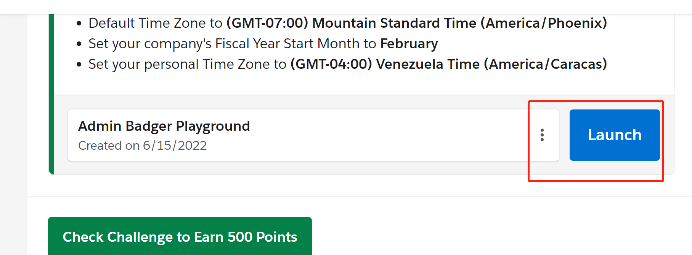
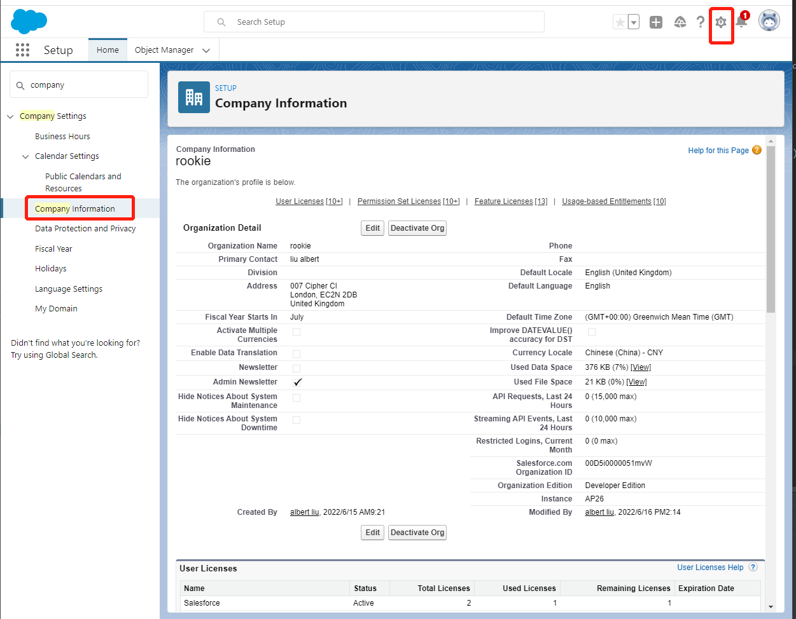
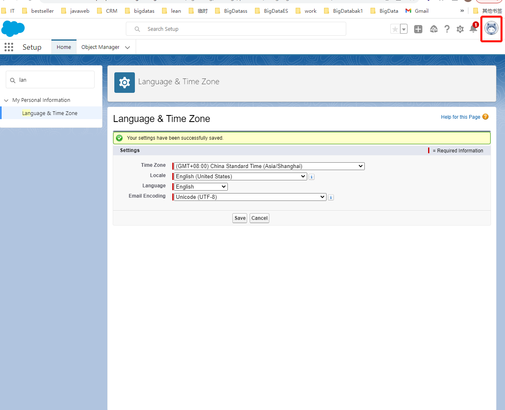

### 申请salesforce 

每个人可以申请一个Developer Edition版本的salesforce org,申请地址如下，申请完成后可以自己按照trailhead自己进行练习。可以在trailhead申请账号，然后按照操作进行任务练习并赚取积分。

[申请地址](https://www.salesforce.com/form/signup/freetrial_training.jsp)

[trailhead地址](https://trailhead.salesforce.com/)

当申请完trailhead账号后，可以在trailhead中创建自己的Playground,也可以打开一个已经存在的Playground，如图

### 公司基本设置

当打开一个Playground后，我们可以进行一些基本的设置

在设置打开后，搜索company，可以对公司的一些基本的信息进行设置，包括语言，用户licenses,时间等等，如图

个人基本设置

如图，可以根据自己的语言等信息进行基本的设置，这样在salesforce的页面显示的时候就是自己的页面

[参考](https://trailhead.salesforce.com/content/learn/modules/company_wide_org_settings?trailmix_creator_id=liualbert&trailmix_slug=admin-trailhead)

