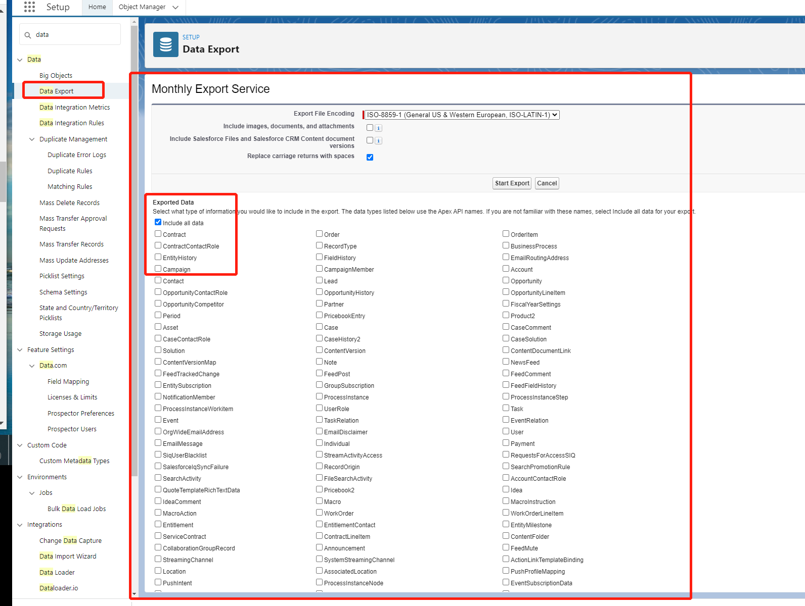
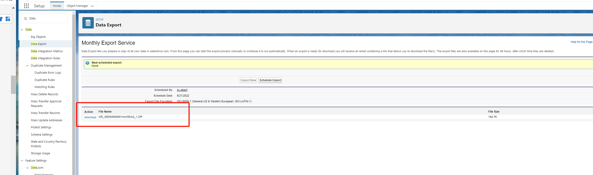

在salesfoce的操作的时候我们难免会将salesforce的数据进行导入或者导出，salesforce的数据导入导出支持两种方式，一种是利用salesforce提供的客户端工具DataLoader,另外一种是通过salesforce的浏览器向导进行数据导入与导出。本文只介绍第二种数据导入与导出的方式

### salesforce数据导出

salesforce的数据导出支持手动导出也支持按照计划定时导出，导出的文件格式为 .csv格式。

直接在选择设置，找到Data export(数据导出)，选择立即导出，最终显示如图：

我选择的是所有数据导出。当选择开始导出的时候会生成一个后台任务，任务执行完成后会生成一个zip文件，直接选择下载即可

### 数据导入