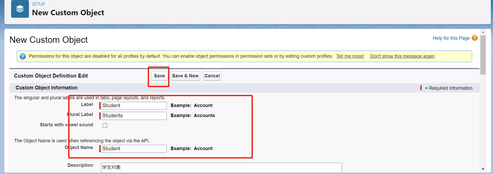
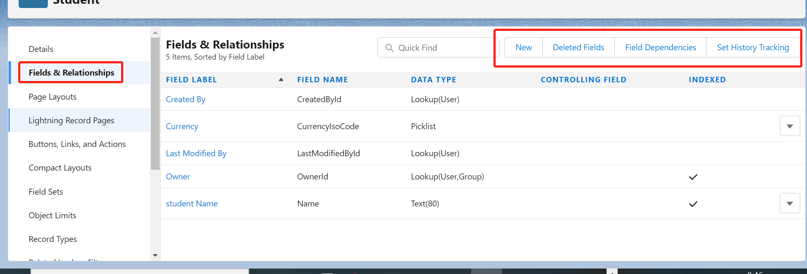
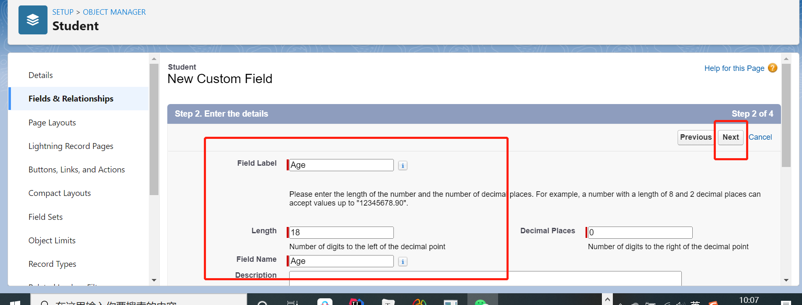
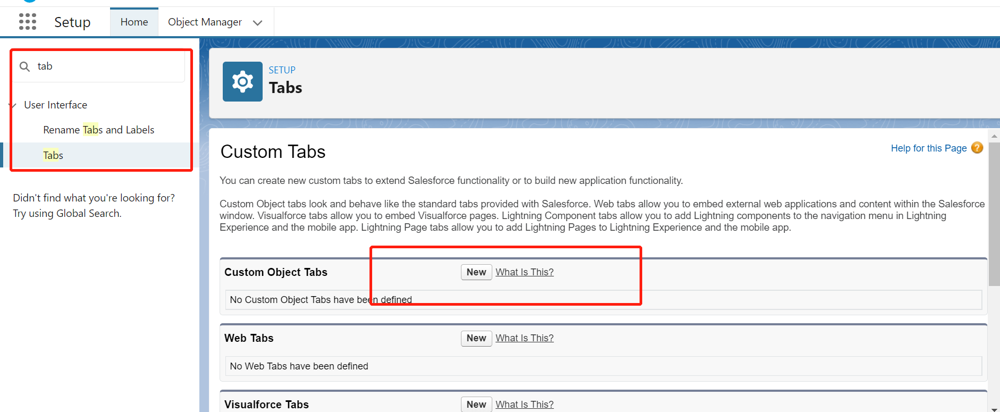
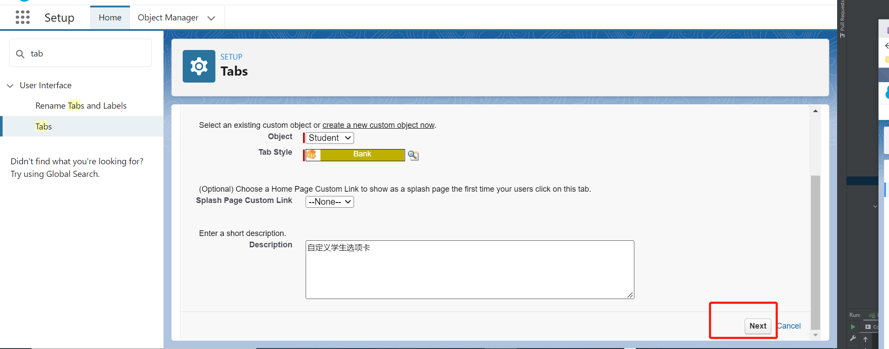
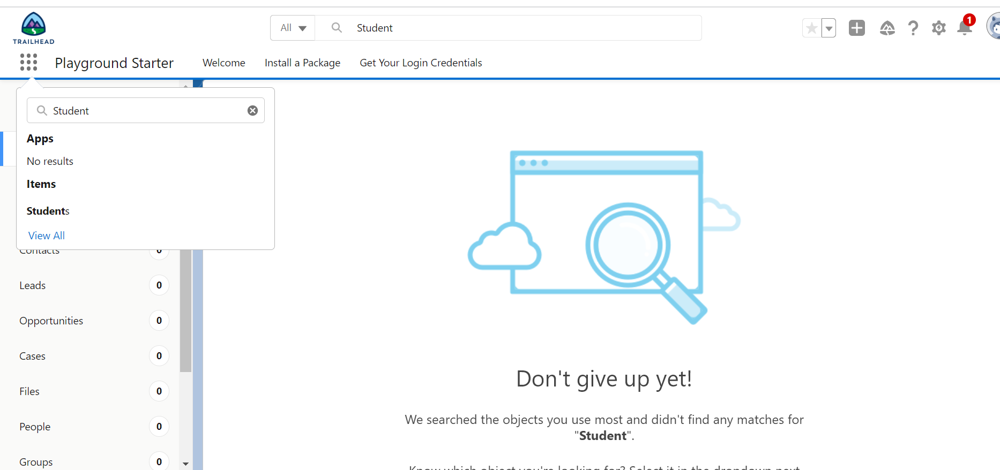
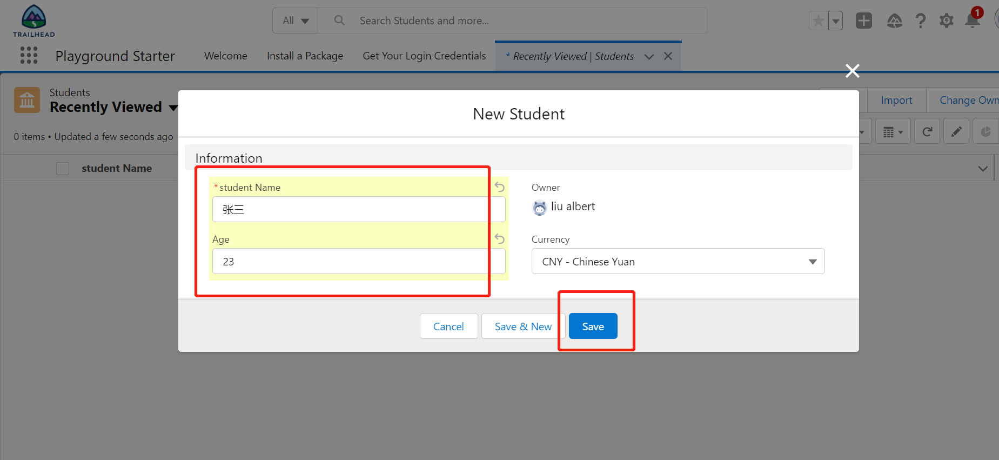

salesforce中的数据模型和我们在java中看到的数据模型有一定的区别，在salesforce中我们会将创建的数据库表视为对象，我们将列视为字段，将行视为记录。
salesforce中的对象主要分为自定义对象和标准对象，其中标准对象是salesforce自带的对象，而自定义对象时我们用户自己创建的对象，自定义创建对象也比较简单，我们可以在自定义对象和标准对象中添加我们自定义的字段，其中自定义字段和自定义对象的API名称都是以__C结尾的，用于区分salesforce中的自定义和标准的对象及字段。

### Object Manage创建对象

Setup ->在左侧搜索Object Manager->点击之后选择右侧的Create Custome Object即可按照操作步骤创建一个自定义对象了

创建完成后如图，我们可以为我们的自定义对象创建字段信息，其中CreatedById，CurrencyIsoCode，LastModifiedById，OwnerId，Name为创建自定义对象后salesforce默认添加的字段信息，是每个对象都存在的信息

为Student创建自定义字段 age

数据类型选在Number,然后点击Next，然后直接输入Age,如图，其他保持默认，一直next直到save。这样字段就创建成功了

其中数据类型主要有以下几种

Auto Number:自动编号	系统使用您定义的显示格式生成的序列编号。该编号对于每条新记录会自动递增。
Formula:公式	根据您定义的公式表达式派生其值的只读字段。任何来源字段有所更改，该公式字段均将更新。
Roll-Up Summary:累计汇总	在相关列表中显示字段的汇总值、最小值或最大值的只读字段，或在相关列表中列出的所有记录的记录数。
External Lookup Relationship:外部查找关系	创建一种关系，将此对象链接到在 Salesforce 组织外部存储数据的外部对象。
Lookup Relationship:查找关系	创建一个将此对象链接到另一对象的关系。关系字段允许用户单击查找图标，以从弹出列表中选择值。另一对象是列表中值的源。

Text (Encrypted):加密文本 
允许用户输入任何字母和数字组合，并将它们以加密格式存储。
Checkbox:复选框	允许用户选择"真"（选取）或"假"（不选取）值。
Text Area (Rich):文本区（RTF）	允许用户输入格式化文本、添加图片和链接。最多有 131,072 个字符在分开行上。
Currency:币种	允许用户输入美元或其他币种金额，并将字段自动转换为币种金额格式。此功能在将数据导出到 Excel 或其它电子表格时非常有用。
Number:数字	允许用户输入任何数字。将删除前置零。
Text:文本	允许用户输入任何字母和数字组合。
Text Area:文本区	允许用户输入多行文本，最多可输入 255 个字符。
Date:日期	允许用户输入日期或从弹出式日历中选择日期。
Date/Time:日期/时间	允许用户输入日期和时间，或从弹出式日历中选择日期。当用户单击弹出式日历中的某个日期后，该日期和当前时间将输入到“日期/时间”字段。
Time:时间	允许用户输入当地时间。例如，"2:40 PM"、"14:40"、"14:40:00" 和 "14:40:50.600" 是此字段的所有有效时间。
Email:电子邮件	允许用户输入电子邮件地址，对其进行验证以确保格式正确。如果对于一个联系人和潜在客户指定了此字段，则用户单击“发送电子邮件”时可以选择地址。注意，自定义电子邮件地址无法用于批量电子邮件。
Phone:电话	允许用户输入任何电话号码。自动将其转换为电话号码格式。
Percent:百分比	允许用户输入百分比数字（例如，"10"），并自动向数字添加百分号。
Picklist:选项列表	允许用户从定义的列表中选择值。
Picklist (Multi-Select):选项列表（多项选择）	允许用户从定义的列表中选择多个值。
:Text Area (Long):文本区（长）	允许用户输入多行文本，最多可输入 131,072 个字符。
URL:允许用户输入任何有效的网址。当用户单击该字段时，该 URL 将在单独的浏览器窗口中打开。

### 创建一条学生记录

首先需要设置自定义选项卡，如下图，自定义选项卡在创建自定义对象的时候也可以进行设置。

设置完成之后，我们就可以在页面搜索到Students页面了，我们就可以创建一个学生记录，如图

我们也可以通过Schema Builder进行更方便的创建自定义对象与自定义字段，读者可以按照trailhead进行练习

[参考](https://trailhead.salesforce.com/content/learn/modules/data_modeling?trail_id=force_com_admin_beginner)

