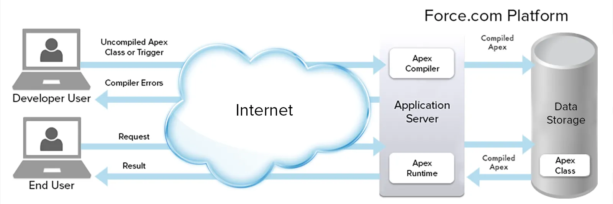
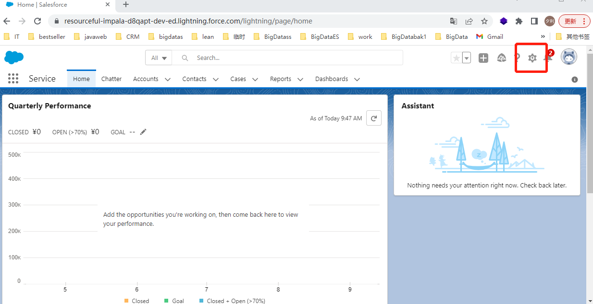
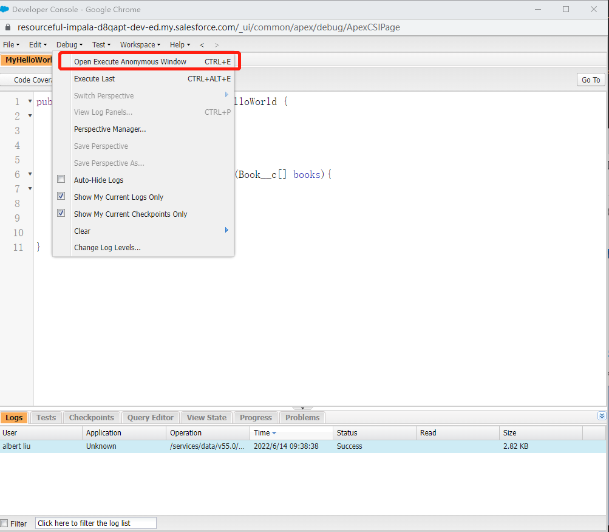
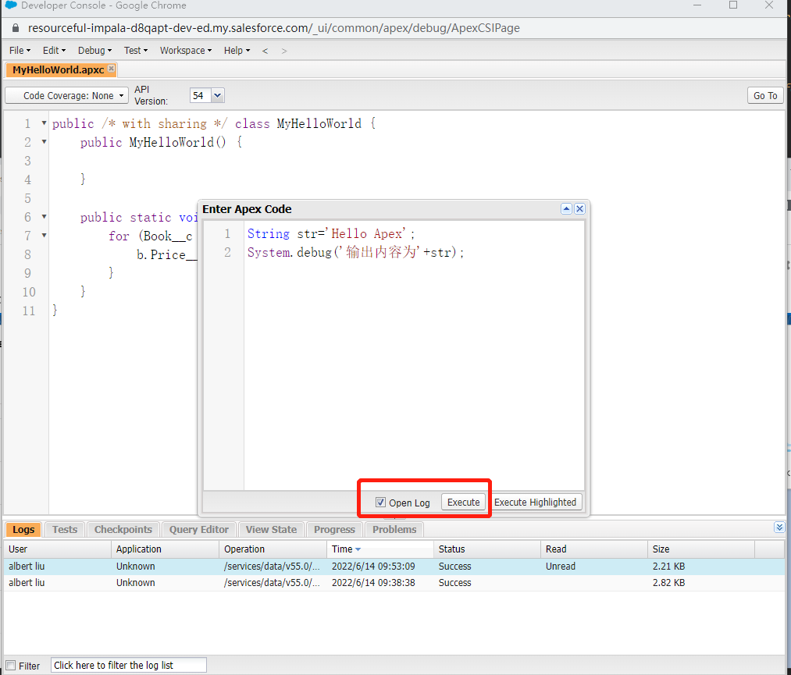
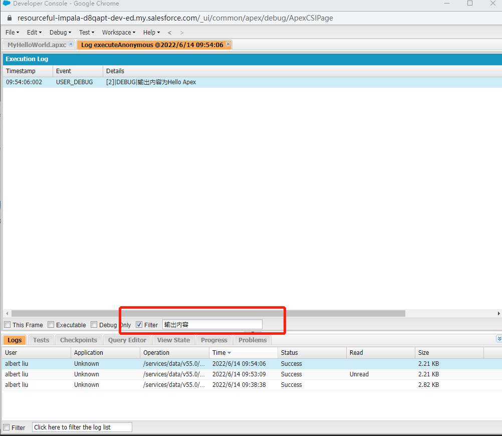

---
title: apex开发基础
date: 2022-06-14 13:33:45
categories: salesforce
tags:
  - apex
---

Apex 是一种编程语言，它具有类似 Java 的语法，其用法与数据库存储过程类似。Apex 允许开发人员将业务逻辑添加到系统事件中，例如按钮的点击、相关记录的更新以及操作 Visualforce 页面等。

### Apex特点

可托管：Apex在Lightning平台服务器上保存、编译和执行

面向对象:Apex 支持类、接口和继承。
强类型:同java一样，Apex会在编译过程中验证对对象的引用
多租户环境:于 Apex 在多租户平台上运行，因此通过实施限制来严密防范代码失控，防止代码独占共享资源。
与数据库集成：直接访问并操作记录。Apex 可直接访问记录和其字段，并提供操作这些记录的语句和查询语言。
与数据紧密结合:Apex 支持数据库的事务性访问，允许回滚操作。
使用简便:Apex 基于熟悉的 Java 习惯用语。
测试方便:Apex 为单元测试的创建、执行和代码覆盖提供内置支持。Salesforce 确保所有的自定义 Apex 代码在任何平台升级之前通过执行所有单元测试按照预期来运行。

apex工作执行流程如下图



### Apex开发工具

Apex开发可以在salesforce的控制台上进行开发，也可以在salesforce推荐的通过集成Salesforce Extension Pack扩展包的VS Code上面进行开发，我先介绍在salesforce控制台上面进行开发。

如下为在控制台上面进行开发的过程









我们可以在控制台进行开发，编辑，测试，debug等等

### Apex数据类型

#### 基本数据类型

primitive(基础类型):
所有的基础类型都是按照值传递的，并且在初始化的时候如果没有赋值的话，默认都为null,这一点和java有点不一样。在使用时要初始化为适当的值。

[数据类型对应的方法参考](https://developer.salesforce.com/docs/atlas.en-us.238.0.apexref.meta/apexref/apex_namespace_System.htm)

Blob:用于存储二进制数据的集合，如下例子

```java
String myString = 'StringToBlob';
//字符串转换为二进制
Blob myBlob = Blob.valueof(myString);
//二进制数据大小
Integer size = myBlob.size();
System.debug('二进制数据为'+myBlob);
System.debug('二进制数据大小为'+size);
```

[方法详解](https://developer.salesforce.com/docs/atlas.en-us.238.0.apexref.meta/apexref/apex_methods_system_blob.htm#apex_System_Blob_methods)

Boolean：用于标识为true或者false

```java
//String类型转换为Boolean类型
Boolean b = Boolean.valueOf('true');
System.assertEquals(true, b);
System.debug('转换类型'+b);
```

[方法详解](https://developer.salesforce.com/docs/atlas.en-us.238.0.apexref.meta/apexref/apex_methods_system_boolean.htm)

Date：日期类型，不包含时间

```java
Date myDate = Date.newInstance(1960, 2, 17);
Date newDate = mydate.addDays(2);
Date nowDate = Date.today();

System.debug('日期数据为'+newDate);
System.debug('今日日期数据为'+nowDate);
```

[方法详解](https://developer.salesforce.com/docs/atlas.en-us.238.0.apexref.meta/apexref/apex_methods_system_date.htm)

Datetime:指示特定的日期和时间值，前面的Date只包括日期不包括时间，这个包括时间

```java
Datetime myDate = Datetime.now();
//Date newDate = mydate.addDays(2);
Date nowDate = Date.today();

System.debug('日期时间数据为'+myDate);
System.debug('今日日期时间数据为'+nowDate);
```

Decimal:包含小数点的数字。小数是任意精度数。货币字段自动分配为 Decimal 类型。


Double：

ID:平台中唯一的标识符，由18个字符组成


Integer: 32位组成的整数，值域为-2147483648 到2147483647


Long: 64位组成的整数，值域为-9223372036854775808到9223372036854775807


Object：Object类型可以存放任何类型的数据，使用的时候可以进行转换


String：字符串


Time：用来表示指定的时间

#### 集合

collection(集合)
Lists:可以包含重复元素的集合
Sets:不能包含重复元素的集合
Maps:映射是键值对的集合，其中每个唯一键映射到单个值
enum:(枚举)：枚举是一种抽象数据类型，其每个值都恰好采用您指定的一组有限标识符中的一个。枚举通常用于定义一组没有数字顺序的可能值。典型的例子包括卡片的花色，或一年中的特定季节。

#### Apex控制语句
Apex控制语句 for,do ***while,while,if***else**,switch等个java类似不再赘述

### Apex运算符

| 操作符 | 语法        | 描述                                                         |
| :----- | :---------- | :----------------------------------------------------------- |
| =      | x = y       | **赋值运算符**,将y的值赋值给x                                |
| +=     | x += y      | **加法赋值运算符**,将y值加上x再赋值给x                       |
| *=     | x *= y      | **乘法赋值运算符**,将y的值乘以x的值并赋值给x                 |
| -=     | x -= y      | **减法赋值运算符**，将x的值减去y的值并重新赋值给x            |
| /=     | x /= y      | **除法赋值运算符**,将x的值除以y的值并重新赋值给y             |
| \|=    | x \|= y     | **OR 赋值运算符**,即当x和y有一个值为true,则x值为true         |
| &=     | x &= y      | **AND 赋值运算符**,即当x和y有一个值为false,则x值为false      |
| <<=    | x <<= y     | **按位左移赋值运算符**。                                     |
| >>=    | x >>= y     | **有符号赋值运算符按位右移**。                               |
| >>>>=  | x >>>= y    | **无符号赋值运算符按位右移**。                               |
| ? ：   | X ？y : z   | **三元运算符**                                               |
| &&     | x && y      | **AND 逻辑运算符**                                           |
| \|\|   | x \|\| 是的 | **OR 逻辑运算符**                                            |
| ==     | x == y      | **等式运算符**。如果值X等于的值是的，表达式的计算结果为真。否则，表达式的计算结果为 false。与 Java 不同，==在 Apex 中，比较对象值相等而不是引用相等，用户定义类型除外。 |
| ===    | x === y     | **精确相等运算符**。可以认为比较的是地址值                   |
| <      | x < y       | **小于运算符**。                                             |
| >      | x > y       | **大于运算符**。                                             |
| <=     | x <= y      | **小于或等于运算符**。                                       |
| >=     | x >= y      | **大于或等于运算符**。                                       |
| !=     | x != y      | **不等式算子**。                                             |
| !==    | x !== y     | **精确不等式运算符**。                                       |
| +      | x + y       | **加法运算符**。                                             |
| -      | x - y       | **减法运算符**。                                             |
| *      | x * y       | **乘法运算符**。                                             |
| /      | x / y       | **除法运算符**。                                             |
| ！     | ！x         | **逻辑补码运算符**。                                         |
| -      | -x          | **一元否定运算符**。                                         |
| ++     | x++,++x     | **增量运算符**。                                             |
| --     | x --,--x    | **递减运算符**。                                             |
| &      | x 和 y      | **按位与运算符**。                                           |
| \|     | x \| 是的   | **按位或运算符**。                                           |
| ^      | x ^ y       | **按位异或运算符**。                                         |
| ^=     | x ^= y      | **按位异或运算符**。                                         |
| <<     | x << y      | **按位左移运算符**。                                         |
| >>     | x >> y      | **按位右移有符号运算符**。                                   |
| >>>    | x >>> y     | **按位右移无符号运算符**。                                   |
| ~      | ~x          | **按位 Not 或 Complement 运算符**。                          |
| ()     | （X）       | **括号**。提升表达式的优先级X                                |
| ?.     | x?.y        | **安全导航操作员**。                                         |

参考：

[Get Started with Apex](https://trailhead.salesforce.com/en/content/learn/modules/apex_database/apex_database_intro)

[Data Types](https://developer.salesforce.com/docs/atlas.en-us.apexcode.meta/apexcode/langCon_apex_primitives.htm)