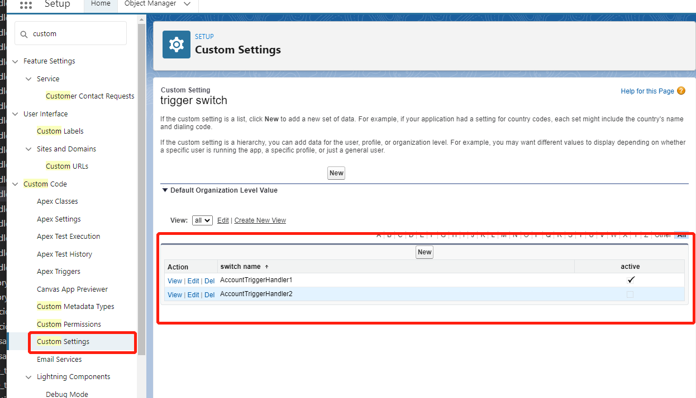

### trigger自定义开关

在前面已经学习了trigger的开发流程，但有时候我们希望该trigger能够随时进行打开和关闭，如果修改代码的话会比较麻烦，我们可以通过在自定义设置里面创建一个对象控制trigger是否进行触发。

本示例的代码由apex trigger用法文章中的代码修改而来的

如图，为创建的trigger switch,里面有两个字段



```
public without sharing class AccountTriggerHandler1 implements Triggers.Handler {
    
    public void handle() {
triggerswitch__c switcher=[select switch_name__c,active__c from triggerswitch__c where switch_name__c='AccountTriggerHandler1'];
		if(switcher == null || switcher.active__c == true){
       //处理复杂的业务逻辑
	   System.debug('执行AccountTriggerHandler1');
		}
	}
   
}
```

```
public without sharing class AccountTriggerHandler2 implements Triggers.Handler {
    
    public void handle() {
triggerswitch__c switcher=[select switch_name__c,active__c from triggerswitch__c where switch_name__c='AccountTriggerHandler2'];
		if(switcher == null || switcher.active__c == true){
       //处理复杂的业务逻辑
	   System.debug('执行AccountTriggerHandler2');
		}
	}
   
}
```

这样我们在trigger触发的时候会执行至AccountTriggerHandler1的代码，而AccountTriggerHandler2的代码会忽略掉。