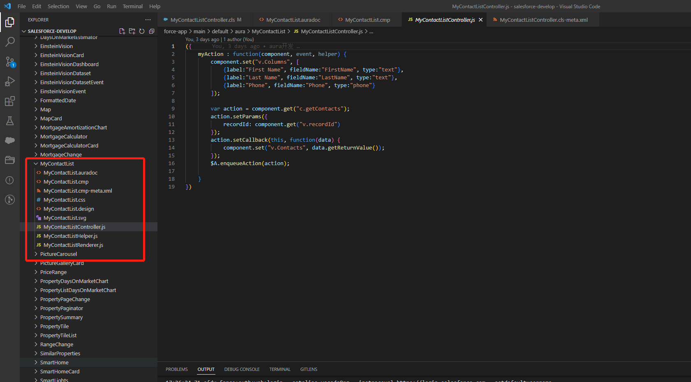

Lightning Component framework是一个ui框架，lightning针对classic，我没有做过classic的开发，但是个人感觉classic的页面是比较丑陋的，而基于	Lightning开发出的页面感觉是比较友好的。从Spring19开始，可以使用两种编程模型来构建 Lightning组件，即Lightning Web Components(LWC组件)和Aura Component(Aura组件)。本篇介绍使用vscoe进行aura的开发。vscode配置查看前面的文章。·

### 配置域名

在进行Lightning开发的时候需要配置My domain,由于我申请的开发版本已经存在自定义域名，不再需要进行配置，所以直接进行开发即可

### 创建工程并Auth org

1、在vs code中按 Ctrl+Shift+P组合键，然后再输入SFDX:Create Project With Manifest,然后按enter键
2、输入工程名称，如VSCodeQuickstart，根据自己需要将工程创建到指定的目录中
3、按Ctrl+Shift+P组合键，然后输入SFDX: Authorize an Org，选择默认的登录URL,后面直接按enter即可
4、根据自己的需要填写manifest/package.xml文件，然后右键选中SFDX:Retrieve Source in Manifest from Org，等待从org下载文件完成即可

### 创建apex

选中classes文件夹，右键选中SFDX:Create Apex Class,并输入MyContactListController，最终生成两个文件MyContactListController.cls和MyContactListController.cls-meta.xml

```xml
<?xml version="1.0" encoding="UTF-8"?>
<ApexClass xmlns="http://soap.sforce.com/2006/04/metadata">
    <apiVersion>55.0</apiVersion>
    <status>Active</status>
</ApexClass>
```

修改MyContactListController.cls文件如下

```java
public with sharing class MyContactListController {
    @AuraEnabled
    public static List<Contact> getContacts(Id recordId) {
        //进行查询
       return [SELECT Id, FirstName, LastName, Email, Phone FROM Contact WHERE AccountId = :recordId];
    }
}
```

选中MyContactListController.cls和MyContactListController.cls-meta.xml，右键SFDX:Deploy Source to Org,将将代码部署到org上了。可以通过salesforce develop console进行查看

### Aura组件创建

选中aura文件夹，右键选中SFDX:Create Aura Component并输入MyContactList,按enter键此时创建Aura组件捆绑包成功，如图



修改MyContactList.cmp和MyContactListController.js
MyContactList.cmp

```java
<aura:component controller="MyContactListController" implements="flexipage:availableForRecordHome,force:hasRecordId" access="global" >
    <aura:attribute name="recordId" type="Id" />
    <aura:attribute name="Account" type="Account" />
    <aura:attribute name="Contacts" type="Contact" />
    <aura:attribute name="Columns" type="List" />
    <aura:handler name="init" value="{!this}" action="{!c.myAction}" />
    <force:recordData aura:id="accountRecord"
                      recordId="{!v.recordId}"
                      targetFields="{!v.Account}"
                      layoutType="FULL"
                      />
    <lightning:card iconName="standard:contact" title="{! 'Contact List for ' + v.Account.Name}">
        <!-- Contact list goes here -->
    <lightning:datatable data="{! v.Contacts }" columns="{! v.Columns }" keyField="Id" hideCheckboxColumn="true"/>
    
    </lightning:card>

</aura:component>
```


MyContactListController.js

```js
({
	myAction : function(component, event, helper) {
        component.set("v.Columns", [
            {label:"First Name", fieldName:"FirstName", type:"text"},
            {label:"Last Name", fieldName:"LastName", type:"text"},
            {label:"Phone", fieldName:"Phone", type:"phone"}
		]);

		var action = component.get("c.getContacts");
	    action.setParams({
	        recordId: component.get("v.recordId")
	    });
	    action.setCallback(this, function(data) {
	        component.set("v.Contacts", data.getReturnValue());
	    });
	    $A.enqueueAction(action);
	
	}

})
```

选中MyContactList文件夹，右键SFDX:Deploy Source to Org,将将代码部署到org上

在Accounts中找到Account 为United Oil & Gas Corp.并打开该页面，从setup gear设置中选择编辑页面，并将MyContactList拖到Activity上面如图.


点击保存，并选中Activate和 Assign as Org Default，然后选中Desktop 并点击Next并保存，此时查看页面变化如图，即相关联的Contact展示出来了


本篇只是展示了如何运用vscode进行aura开发，里面的代码暂时不需要理解，后续会进行Aura更详细的讲解


[参考](https://trailhead.salesforce.com/content/learn/projects/quickstart-lightning-components)