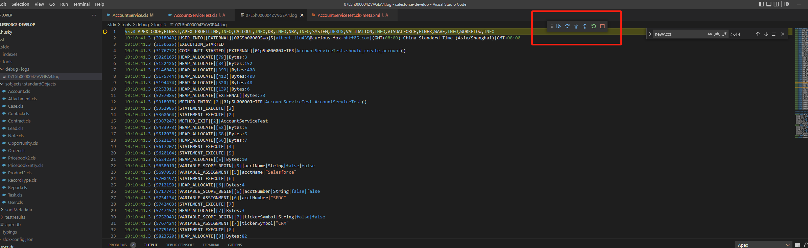

### 创建工程

我这里创建的命令用的是SFDX:Create Project with Manifest，可以参考第一篇文章 vscode配置salesforce开发进行org认证的连接等操作
创建两个apex文件，如图


AccountService

```java
public with sharing class AccountService {
  public Account createAccount( String accountName, String accountNumber, String tickerSymbol ) {
    Account newAcct = new Account(
      Name = accountName,
      AccountNumber = accountNumber,
      TickerSymbol = accountNumber
    );
    return newAcct;
  }
}
```

AccountServiceTest

```java
@IsTest
private class AccountServiceTest {
  @IsTest
  static void should_create_account() {
    String acctName = 'Salesforce';
    String acctNumber = 'SFDC';
    String tickerSymbol = 'CRM';
    Test.startTest();
      AccountService service = new AccountService();
      Account newAcct = service.createAccount( acctName, acctNumber, tickerSymbol );
      insert newAcct;
    Test.stopTest();
    List<Account> accts = [ SELECT Id, Name, AccountNumber, TickerSymbol FROM Account WHERE Id = :newAcct.Id ];
    System.assertEquals( 1, accts.size(), 'should have found new account' );
    System.assertEquals( acctName, accts[0].Name, 'incorrect name' );
    System.assertEquals( acctNumber, accts[0].AccountNumber, 'incorrect account number' );
    System.assertEquals( tickerSymbol, accts[0].TickerSymbol, 'incorrect ticker symbol' );
  }
}
```

选中上图的四个文件，右键并选择SFDX:Deploy Source to Org，部署成功后点击AccountServiceTest.cls中长度Run Test进行跑测试类，此时控制台会出现一个错误的信息，如图


### 设置断点并进行debug

将鼠标移动到return newAcct这一行代码，然后按住Ctrl+Shift+P并选中SFDX: Toggle Checkpoint，此时可以看到已经打上断点，如图


然后按住Ctrl+Shift+P并选中SFDX: Update Checkpoints in Org. 

#### 获取debug logs

按住Ctrl+Shift+P并选中SFDX: Turn On Apex Debug Log for Replay，然后重新选择SFDX: Run Apex Tests.并选择 AccountServiceTest进行测试类运行，运行完之后通过FDX: Get Apex Debug Logs获取log,如图


打开文件，然后右键打开并选择SFDX: Launch Apex Replay Debugger with Current File，即可进行一步一步的调试，如图




然后找出bug并修复即可

也可以直接点击Debug Test进行调试，如图


debug本地调试就是如此简单。

[参考](https://trailhead.salesforce.com/content/learn/projects/find-and-fix-bugs-with-apex-replay-debugger)