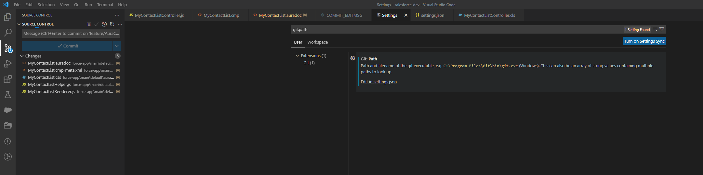
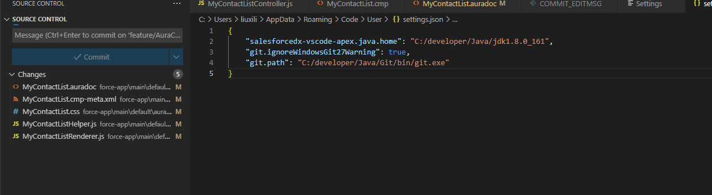
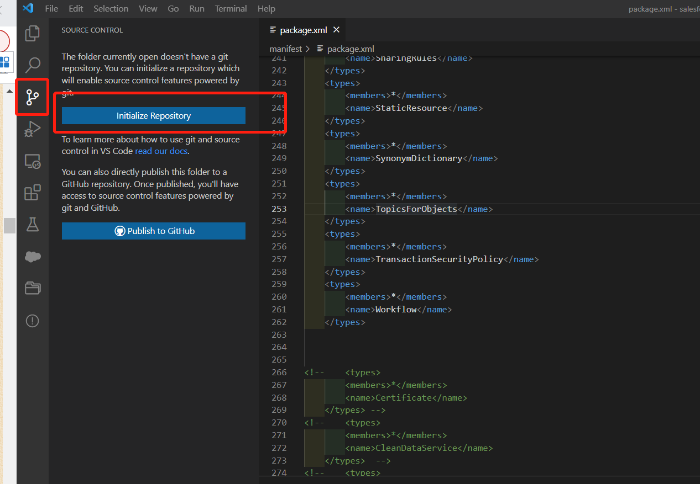
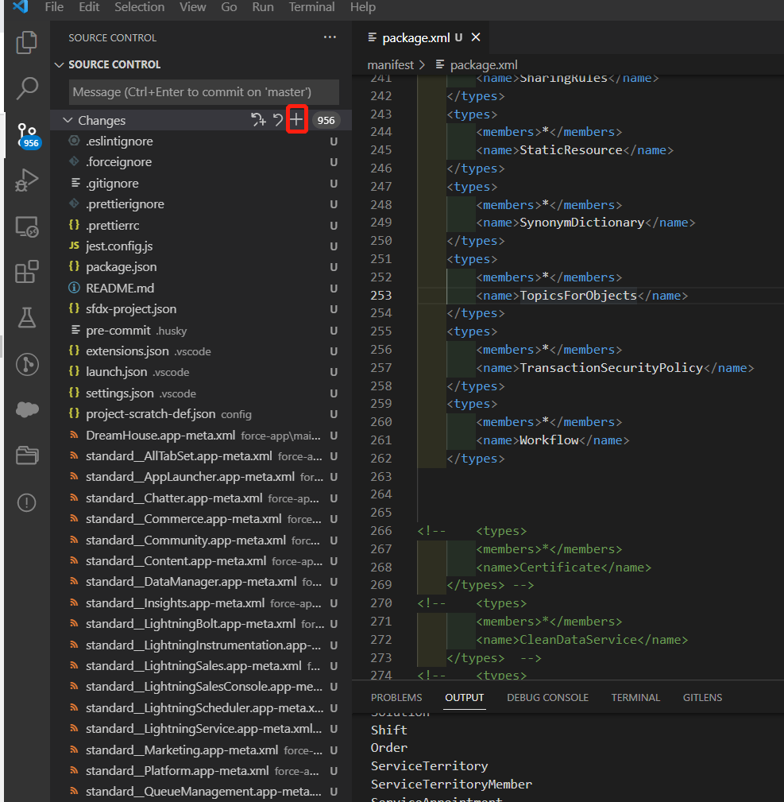
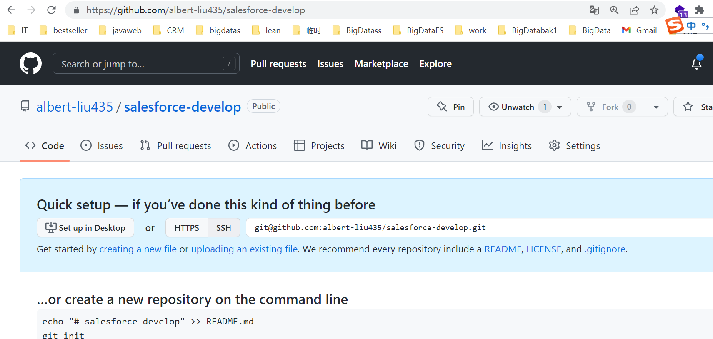
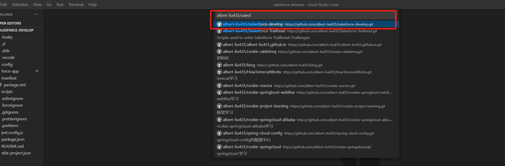
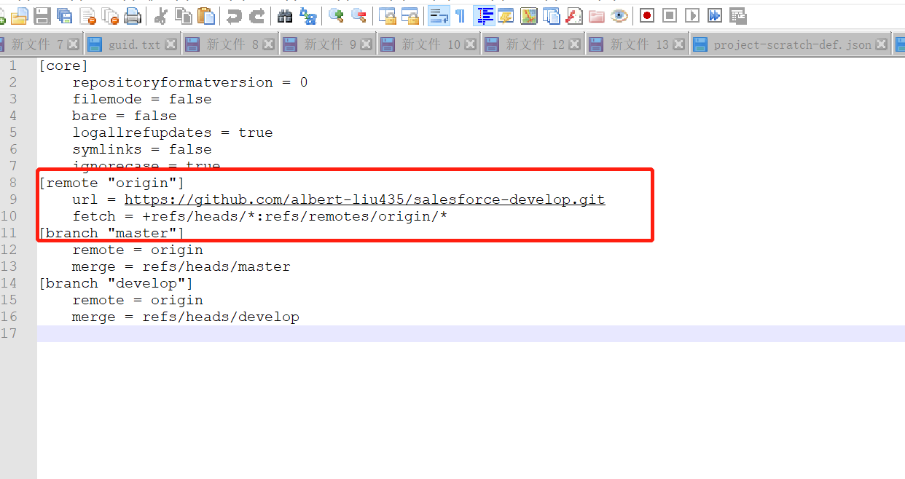
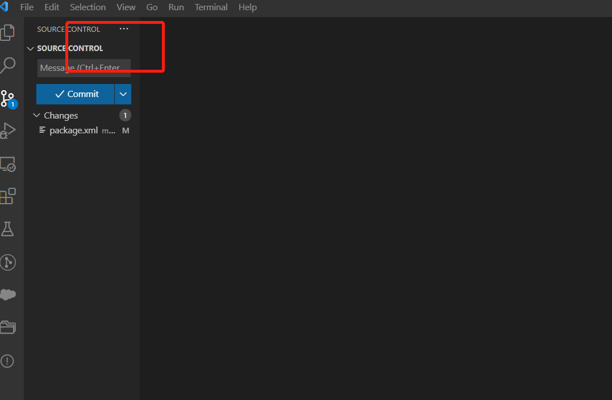

本章默认你已经安装了git及salesforce相关的工具，如果没有安装git百度自行安装

首先初始化本地代码，从org中拉取最新的代码，然后按照如下步骤操作

配置git路径，如图

### 初始化代码

### 加入到暂存区并添加commit

.png)

### 连接远程github

首先在github上创建一个仓库，如图

.png)

.png)

.png)

.png)

-1657247259149.png)

不知道为什么 第一次push必须使用命令才能完成
git push -u origin master -f 

下图通过这里可以直接操作分支

也可以直接使用git命令进行操作，参考如下

https://www.cnblogs.com/xzdz/p/15611097.html