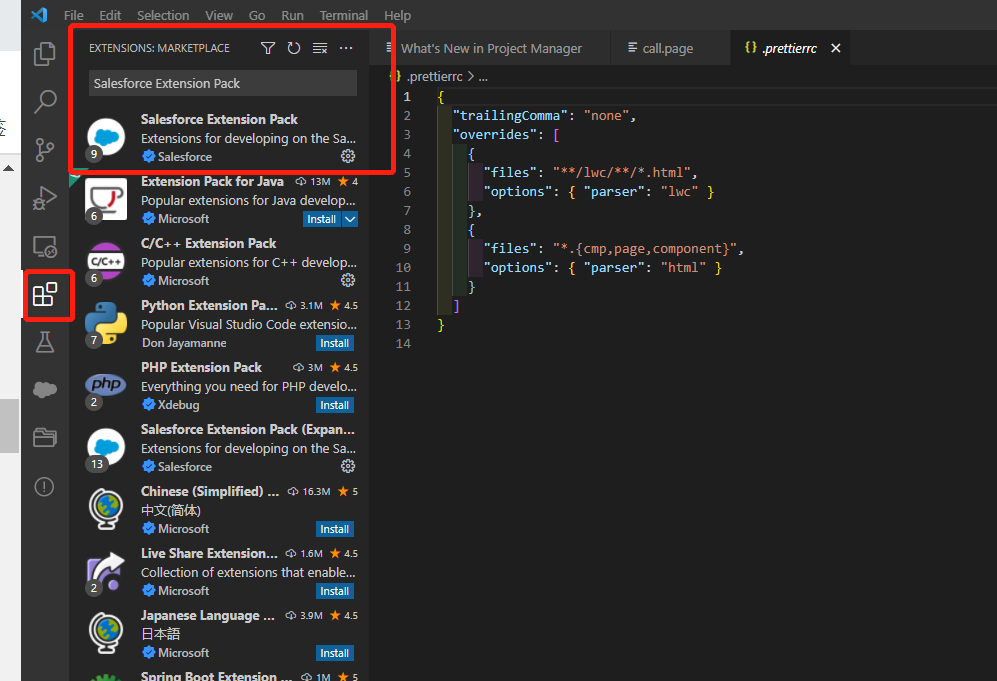
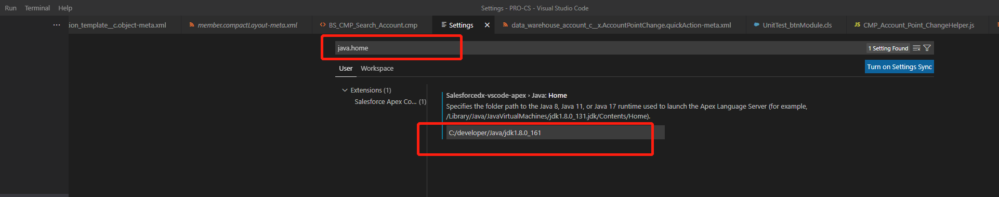
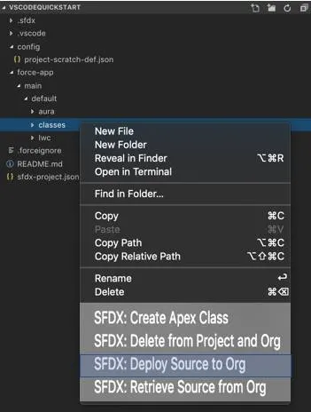

---
title: vscode配置salesforce开发
date: 2022-06-10 13:33:45
categories: salesforce
tags:
  - vscode
---


### 工具准备

JDK>=JDK1.8,vscode,salesforce CLi

[JDK下载地址](https://www.oracle.com/java/technologies/javase/upgrade.html)

[vscode下载地址](https://code.visualstudio.com/)

[salesforce CLi下载地址](https://developer.salesforce.com/tools/sfdxcli)

下载完成之后进行安装，这里不再赘述

### vsCode 安装salesforce扩展

在VS Code的左侧工具栏单击Extensions.然后再搜索框中输入Salesforce Extension Pack，再点击install即可，如下图，我已经安装了，所以没有install按钮，如图



### 设置java home

File->Preferences->Settings
搜索java.home进行配置java的目录，如图我的目录如下，这样在后续开发的时候可以在本地进行调试


### VScode配置与salesforce连接与开发

File->Preferences->Settings
搜索java.home进行配置java的目录，如图我的目录如下，这样在后续开发的时候可以在本地进行调试



#### 创建工程

1、在vs code中按 Ctrl+Shift+P组合键，然后再输入SFDX:Create Project,然后按enter键

2、输入工程名称，如VSCodeQuickstart，根据自己需要将工程创建到指定的目录中

3、按Ctrl+P组合键进行搜索文件，如project-scratch-def.json，对里面的orgName进行重新命名为Wise Shark Playground然后保存

#### 进行org身份认证

1、按Ctrl+Shift+P组合键，然后输入SFDX: Authorize an Org，选择默认的登录URL,输入orgName 为Wise Shark Playground进行认证授权

2、按住Ctrl+Shift+P，然后输入SFDX: Create Apex Class，输入AccountController创建一个apx

代码如下,按Ctril+S进行文件保存

```java
public with sharing class AccountController {
    public static List<Account> getAllActiveAccounts() {
      return [SELECT Id,Name,Active__c FROM Account WHERE Active__c = 'Yes'];
    }
  }
```

#### 进行sql查询及部署

1、按Ctrl+Shift+P组合键，然后输入SFDX:Execute SOQL Query with Currently Selected Text，然后将SELECT Id,Name,Active__c FROM Account WHERE Active__c = 'Yes'放入，选择Rest API并按Enter键即可看到相应的查询出的数据

2、按照如下进行部署,点击**SFDX: Deploy Source to Org**.进行部署



这样配置以后就可以用vscode进行salesforce的开发了。

[参考](https://developer.salesforce.com/tools/vscode/en/getting-started/install)