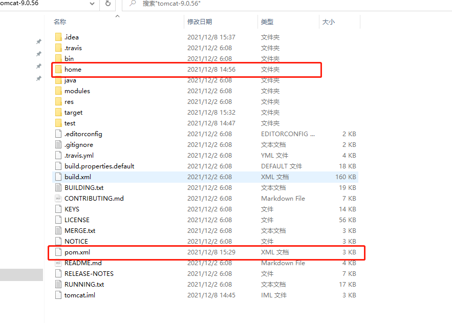
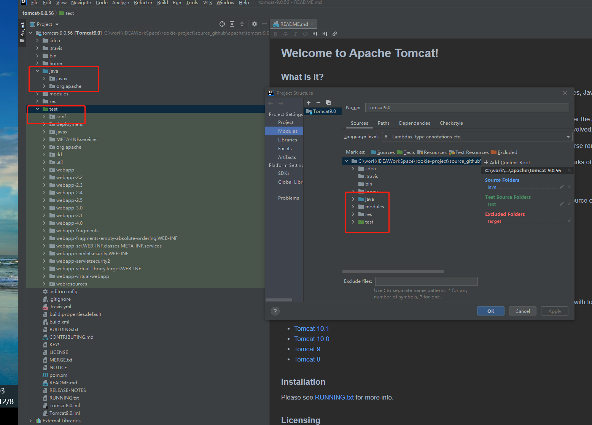
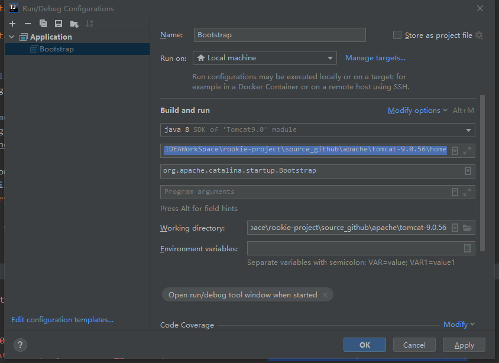
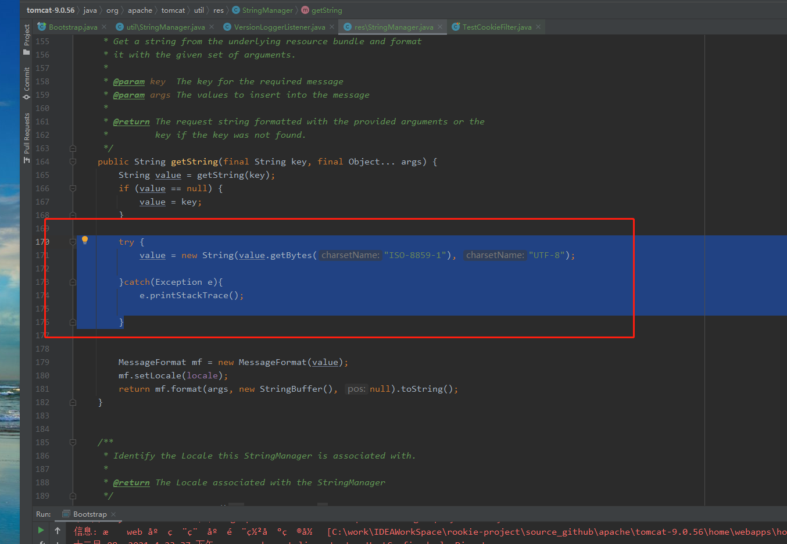
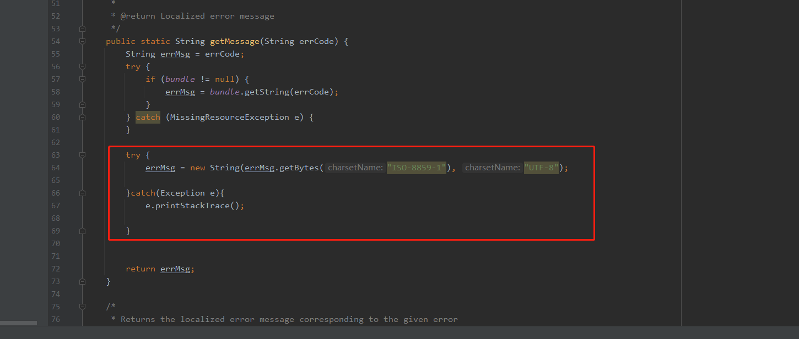
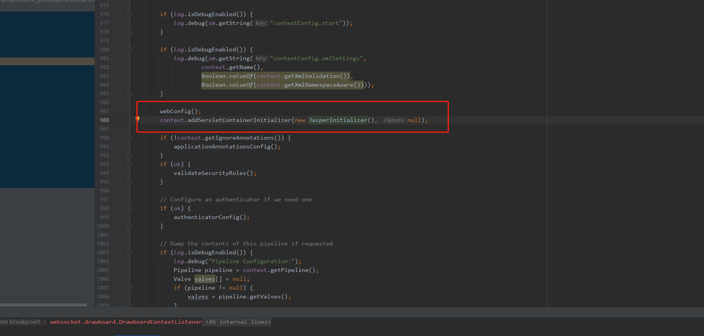
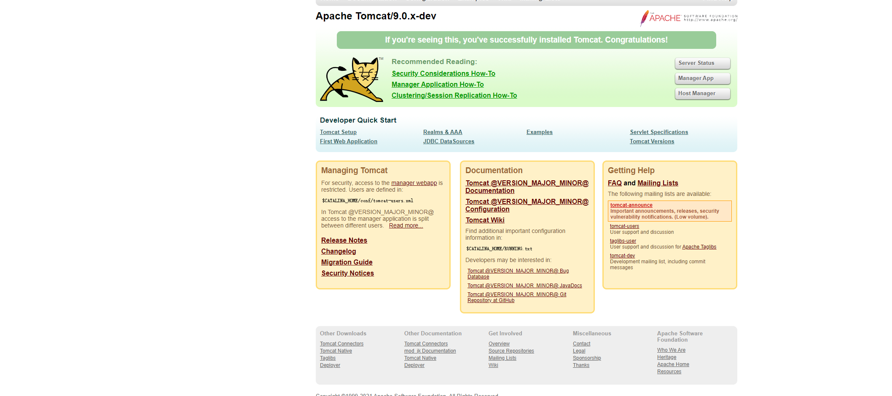

要进行tomcat源码阅读，首先需要经源码下载下来，并导入到idea中能够运行起来，下面是tomcat9.0.56源码的导入过程

### 下载源码

[源码下载地址](https://github.com/apache/tomcat/tags)

### 解压源码

解压源码到指定目录，并创建home文件夹，将conf文件夹和webapps文件夹移动到home文件夹里面，并在根目录下创建pom.xml文件

本示例解压目录为：C:\work\IDEAWorkSpace\rookie-project\source_github\apache\tomcat-9.0.56，最终的结构如下



pom文件内容如下：

```xml

<?xml version="1.0" encoding="UTF-8"?>
<project xmlns="http://maven.apache.org/POM/4.0.0"
         xmlns:xsi="http://www.w3.org/2001/XMLSchema-instance"
         xsi:schemaLocation="http://maven.apache.org/POM/4.0.0 http://maven.apache.org/xsd/maven-4.0.0.xsd">
  <modelVersion>4.0.0</modelVersion>
  <groupId>org.apache.tomcat</groupId>
  <artifactId>Tomcat8.0</artifactId>
  <name>Tomcat8.0</name>
  <version>8.0</version>
  <build>
    <finalName>Tomcat8.0</finalName>
    <sourceDirectory>java</sourceDirectory>
    <resources>
      <resource>
        <directory>java</directory>
      </resource>
    </resources>
    <plugins>
      <plugin>
        <groupId>org.apache.maven.plugins</groupId>
        <artifactId>maven-compiler-plugin</artifactId>
        <version>2.3</version>
        <configuration>
          <encoding>UTF-8</encoding>
          <source>1.8</source>
          <target>1.8</target>
        </configuration>
      </plugin>
    </plugins>
  </build>
  <dependencies>
    <dependency>
      <groupId>junit</groupId>
      <artifactId>junit</artifactId>
      <version>4.12</version>
      <scope>test</scope>
    </dependency>
    <dependency>
      <groupId>ant</groupId>
      <artifactId>ant</artifactId>
      <version>1.7.0</version>
    </dependency>
    <dependency>
      <groupId>wsdl4j</groupId>
      <artifactId>wsdl4j</artifactId>
      <version>1.6.3</version>
    </dependency>
    <dependency>
      <groupId>javax.xml</groupId>
      <artifactId>jaxrpc</artifactId>
      <version>1.1</version>
    </dependency>

    <dependency>
      <groupId>org.eclipse.jdt</groupId>
      <artifactId>ecj</artifactId>
      <version>3.26.0</version>
    </dependency>

    <!-- https://mvnrepository.com/artifact/org.easymock/easymock -->
    <dependency>
      <groupId>org.easymock</groupId>
      <artifactId>easymock</artifactId>
      <version>4.3</version>
      <scope>test</scope>
    </dependency>

    <!-- https://mvnrepository.com/artifact/com.unboundid/unboundid-ldapsdk -->
    <dependency>
      <groupId>com.unboundid</groupId>
      <artifactId>unboundid-ldapsdk</artifactId>
      <version>6.0.2</version>
      <scope>test</scope>
    </dependency>

    <dependency>
      <groupId>biz.aQute.bnd</groupId>
      <artifactId>biz.aQute.bndlib</artifactId>
      <version>5.2.0</version>
      <scope>provided</scope>
    </dependency>

  </dependencies>
</project>
```

### 将源码导入到Idea中

导入源码，并设置把 java 文件夹标记为 Sources，test 文件夹标记为 Tests，如下图



### 运行

运行中Bootstrap的main方法，最终会变成报错，需要做如下操作

1、ResponseTrailers 找不到，把 home\webapps\examples\WEB-INF\classes\trailers 目录拷贝到 test 目录下

2、CookieFilter 找不到，把 home\webapps\examples\WEB-INF\classes\util\CookieFilter.java 文件拷贝到 test\util 目录下

再次运行会报conf\server.xml (系统找不到指定的路径。)错误信息，需要配置jvm 参数（就是指定之前创建的 home 目录）

配置方式 run->edit Configurations中配置-Dcatalina.home=C:\work\IDEAWorkSpace\rookie-project\source_github\apache\tomcat-9.0.56\home 如图：



再次运行会有乱码出现，需要更改如下：

找到org.apache.tomcat.util.res.StringManager类，并添加如下代码



如果还有其他乱码，找到相关代码按照上面相关原理添加字符转换即可

如org.apache.jasper.servlet.TldScanner 的scanJars()方法，找到org.apache.jasper.compiler.Localizer添加如下代码



org.apache.catalina.startup.ContextConfig 文件的 configureStart() 方法，添加初始化 JSP 解析器的代码

```java
context.addServletContainerInitializer(new JasperInitializer(), null);
```



访问http://localhost:8080/方法，出现如下即成功



[项目源码](https://github.com/albert-liu435/tomcat9.0)