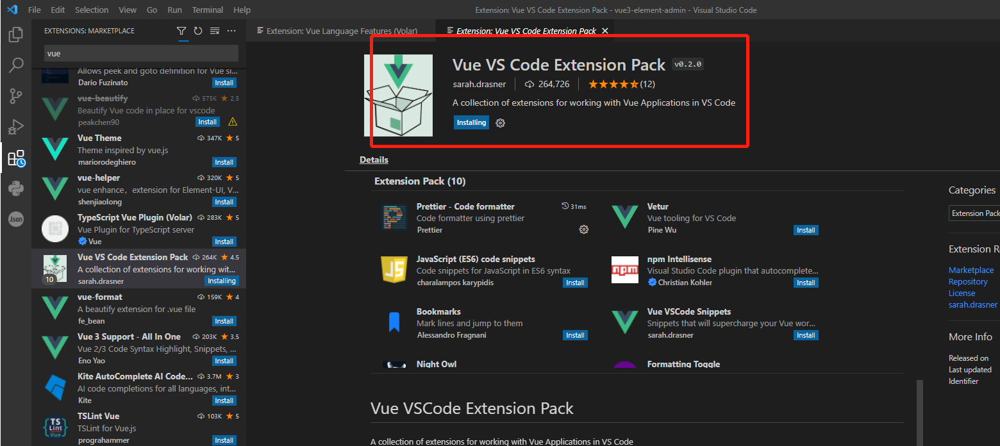
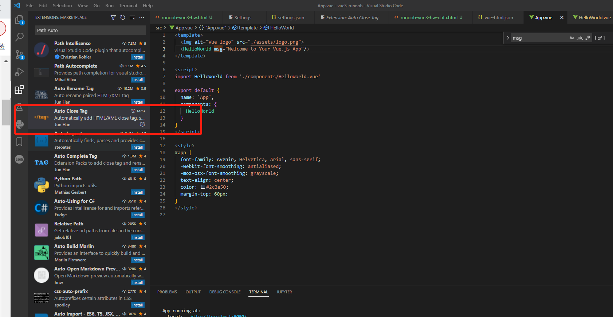

### vscode设置vue扩展



### NPM安装

vue需要安装npm和vue及Vue Cli

npm安装自己从官网下载即可，vue和Vue Cli安装命令如下

```shell
npm install vue@next
npm install -g @vue/cli
```

也可以使用Vite 进行创建，可以参考

https://www.runoob.com/vue3/vue3-install.html

https://vitejs.cn/guide/#overview

https://www.vitejs.net/guide/#trying-vite-online

创建vue命令

```shell
vue create runoob-vue3-app
```

vue设置html自动补全插件



### VUE配置

Ctrl+Shift+P,然后找到settings.json

vue的格式化配置如下：

```json
{
    "salesforcedx-vscode-apex.java.home": "D:\\developer\\java\\jdk\\jdk1.8.0_131",
    "redhat.telemetry.enabled": false,
    "java.configuration.runtimes": [
    {
        "name": "JavaSE-1.8",
        "path": "D:\\developer\\java\\jdk\\jdk1.8.0_131",
    },
    ],
    "files.autoGuessEncoding": true,
    "git.autofetch": true,
    "vetur.completion.scaffoldSnippetSources": {

        "workspace": "💼",
        "user": "🗒️",
        "vetur": "✌"
    }, "editor.fontSize": 17,//编辑器字体大小
    "[scss]": {
        "editor.defaultFormatter": "michelemelluso.code-beautifier"
    },//scss格式化工具
    "workbench.iconTheme": "vscode-icons",//vscode文件图标主题
    "terminal.integrated.shell.windows": "C:\\Windows\\System32\\WindowsPowerShell\\v1.0\\powershell.exe",//默认终端shell
    "go.formatTool": "goimports",//golang格式化工具
    "editor.defaultFormatter": "esbenp.prettier-vscode", //编辑器格式化工具
    "[javascript]": {
      "editor.defaultFormatter": "rvest.vs-code-prettier-eslint"
    },//javascript格式化工具
    "[vue]": {
      "editor.defaultFormatter": "octref.vetur"
    },//vue格式化工具
    "editor.insertSpaces": false,
    "workbench.editor.enablePreview": false, //打开文件不覆盖
    "search.followSymlinks": false, //关闭rg.exe进程
    "editor.minimap.enabled": false, //关闭快速预览
    "files.autoSave": "afterDelay", //编辑自动保存
    "editor.lineNumbers": "on", //开启行数提示
    "editor.quickSuggestions": {
      //开启自动显示建议
      "other": true,
      "comments": true,
      "strings": true
    },
    "editor.tabSize": 2, //制表符符号eslint
    "editor.formatOnSave": true, //每次保存自动格式化
    // "eslint.codeActionsOnSave": {
    //     "source.fixAll.eslint": true
    // },
    "prettier.eslintIntegration": true, //让prettier使用eslint的代码格式进行校验
    "prettier.semi": true, //去掉代码结尾的分号
    "prettier.singleQuote": false, //使用单引号替代双引号
    "javascript.format.insertSpaceBeforeFunctionParenthesis": true, //让函数(名)和后面的括号之间加个空格
    "vetur.format.defaultFormatter.html": "js-beautify-html", //格式化.vue中html
    "vetur.format.defaultFormatter.js": "vscode-typescript", //让vue中的js按编辑器自带的ts格式进行格式化
    "vetur.format.defaultFormatterOptions": {
      "js-beautify-html": {
        "wrap_attributes": "force-aligned" //属性强制折行对齐
      },
      "prettier": {
        "semi": false,
        "singleQuote": true
      },
      "vscode-typescript": {
        "semi": false,
        "singleQuote": true
      }
    },
    "eslint.validate": [
      "vue",
      // "javascript",
      "typescript",
      "typescriptreact",
      "html"
    ],
    "editor.codeActionsOnSave": {
      "source.fixAll.eslint": true
    }

}
```


